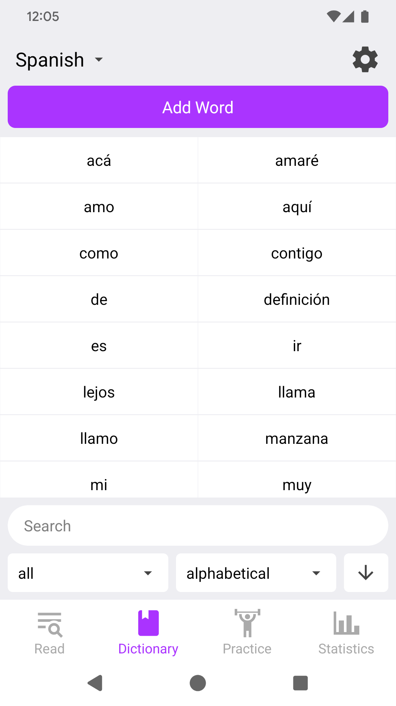
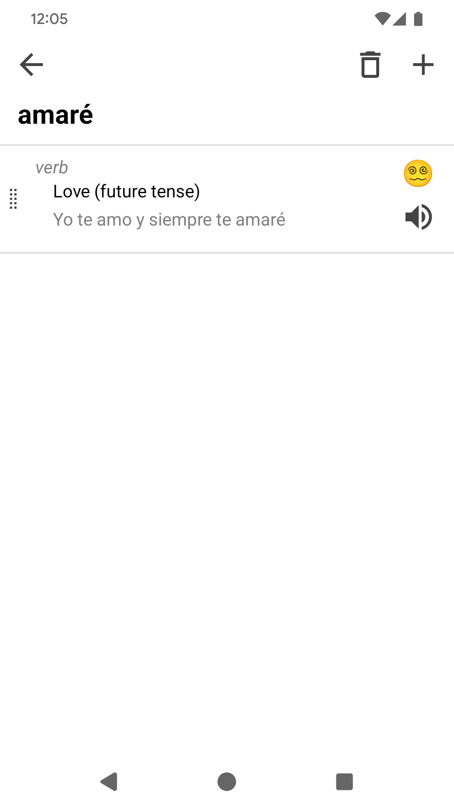
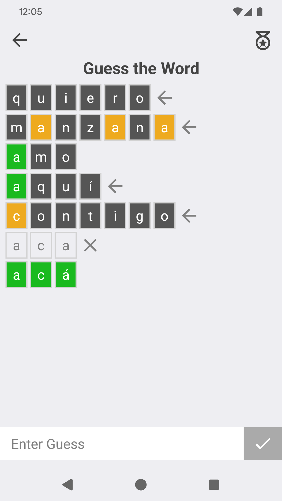
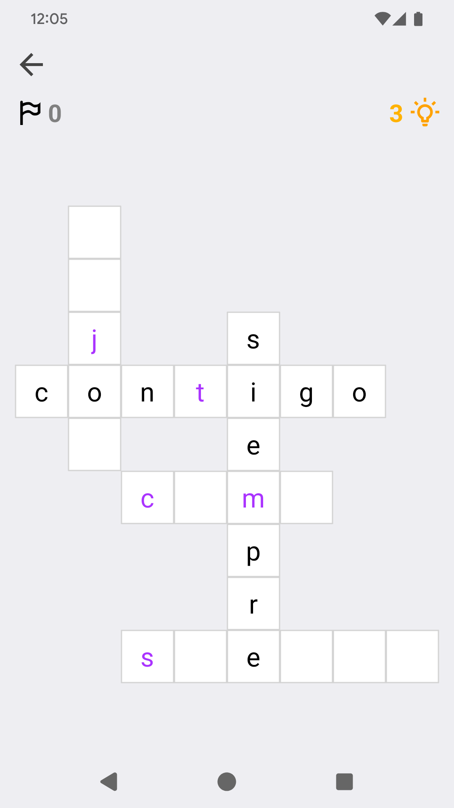
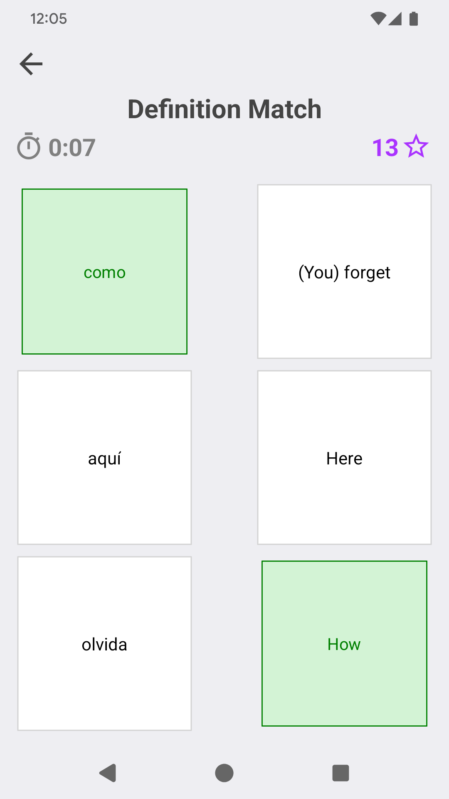
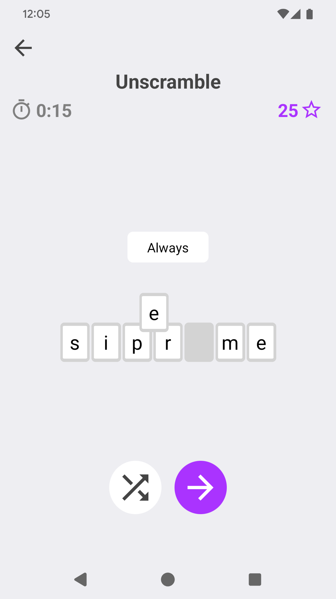

# Language Dex

A personal dictionary and language study app.

<p align="center">
  <a href="https://play.google.com/store/apps/details?id=dev.arthurcose.languagedex">
    
  </a>
</p>


https://f-droid.org/packages/dev.arthurcose.languagedex/

## Screenshots

<p align="center">
  
  
  
</p>
<p align="center">
  
  
  
</p>

## Philosophy

Language Dex is not designed to be your sole learning tool, no app should be.
It is aimed to be a supplementary practice and personal progress tracking app for any language you are learning.
It can also be used as a general study app, as you can load custom vocabulary necessary for any subject.

The intention behind having users add words themselves is to push users to research and interact more with the words being studied and to lean the user to write definitions in their own words.

Below are reasonings for the pratice games included in Language Dex:

### Definition Match + Unscramble

These are light practice games, aimed at getting you familiar with words you've recently added.

### Guess the Word

A fun Wordle inspired practice game that tests your vocabulary and spelling. Only words you've saved to your dictionary can be used to play, providing reason to add new words to your dictionary.

### Crossword + Short Answer

Crossword is a lighter practice version of Short Answer with some initial character and word length hints.

Short Answer tests you on words more directly, checking to see whether you can remember a word and its spelling using only the definition.

### Use in a Sentence + Pronunciation

Use in a Sentence is a difficult personal test to see your creative usage of a word, while Pronunciation is simple direct pronunciation practice for individual words.

Completing these practice games for a word also allows you fill out the Example and Pronunciation sections of the word's data. Each have a way to directly compare with the existing data for you to choose the best version to keep.

## Develop

This is an [Expo](https://expo.dev) project created with [`create-expo-app`](https://www.npmjs.com/package/create-expo-app).

1. Install dependencies

```bash
yarn
yarn run licenses
```

2. Connect your phone with debugging enabled and start the app

```bash
yarn run android
```

## Structure

- `/app`: Page level components using [file-based routing](https://docs.expo.dev/router/introduction).
- `/lib`: Components and utility files
- `/assets`: App assets (icons, splash screens)
- `/licenses`: Extra license files for license-ripper
- `/scripts`: Tools and build scripts

`@/` in `import` statements point to the project root. (`@/lib` points to `/lib`)
